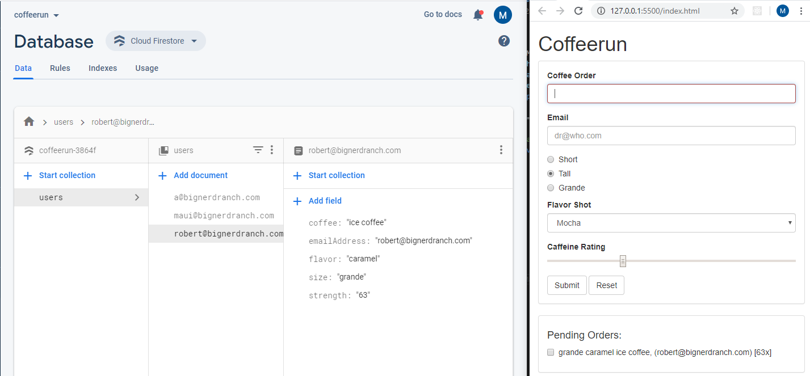

# CoffeeRunWithFirebase
The Entire CoffeeRun Project with Firebase for the backend

# Directions
Finish chapter 12 (Form Validation) and chapter 13 (Ajax) to connect to the back-end service at herokup. Then Modify scripts/remotedatastore.js as necessary to use Firebase as CoffeeRun's back-end
  

